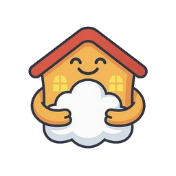
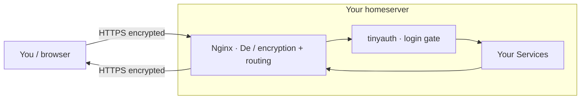

# Neo Homeserver

  

**Your data. Your machine. Your software.**

Neo is a complete homeserver you can actually run yourself—without becoming a full-time sysadmin. It gives you the strengths of a modern Nix-based system (reproducible, revertable, recoverable) with **opinionated defaults** and a simple **web interface**. You choose what to turn on; Neo handles HTTPS, updates, firewalling, and the rest.

You should not need a technical background to understand what is going on. If you care about **owning your data and your software**, and you do not want to maintain a fragile pile of Docker Compose files by hand, Neo is for you.

## Why this exists

Big tech wants you renting access forever: your photos on their cloud, your documents on their servers, your passwords and habits as their product. You do not really _own_ the service—you have a login until the terms change.

Neo flips that model:

- **Everything lives on your homeserver.** Photos, files, passwords, documents, media—on hardware you control.
- **You own the software.** The stack is open source. You can inspect it, keep it, move it, and run it without a vendor’s permission.
- **Privacy by design.** Traffic is encrypted with TLS until it reaches _your_ machine. Services sit behind authentication. The machine only needs the usual web ports open—not a wide-open network.
- **No “learn Nginx, Let’s Encrypt, and compose” tax.** Neo is opinionated so sensible defaults do the heavy lifting. Day to day you use the **Neo web UI**, not a command line.

That spirit—**if you can’t host it and control it, you don’t really own it**—is the same fight people like [Louis Rossmann](https://www.youtube.com/watch?v=rk3snANxYMY) make for repair, ownership, and a [self-managed life](https://wiki.futo.org/wiki/Introduction_to_a_Self_Managed_Life:_a_13_hour_%26_28_minute_presentation_by_FUTO_software) instead of permanent rental from Big Tech.

## What you need

| You need                                                                     | You do **not** need                        |
| ---------------------------------------------------------------------------- | ------------------------------------------ |
| A computer (or VPS) that can run the homeserver                              | Deep Linux or Nix knowledge                |
| A **public IP** _or_ access to a **streamproxy** token from a public machine | To open random ports all over your network |
| A domain name pointed at that public endpoint                                | To hand-maintain Docker Compose            |
| Willingness to click through a setup UI                                      | To become a reverse-proxy expert           |

Only **ports 80 and 443** need to be reachable from the internet (or from your streamproxy path). Everything else stays on the machine. The server does not have to be a public cloud box sitting “in the internet”—it can live at home; it only needs that path for HTTPS.

## How communication works

Your browser always talks **HTTPS** to Neo. Encryption is terminated on _your_ server; apps talk among themselves inside a protected network; answers are encrypted again before they go back out.

- **Ingress** — traffic arrives on your public IP **or** via streamproxy (same idea from your point of view).
- **TLS** — Nginx unwraps encryption only on your machine, then routes to the right service.
- **Double protection** — almost every service is behind **tinyauth** _and_ the app’s own login where applicable: two layers, not “hope nobody finds the port.”
- **Inside the box** — apps run as containers on an internal network; they are not casually exposed to the world.
- **Auto-updates** — system and containers pick up new software without you babysitting upgrades every weekend.

More detail: [docs/ARCHITECTURE.md](docs/ARCHITECTURE.md).

## Features that do the hard work for you

- **Automatic HTTPS** — certificates and encryption handled for you; traffic is encrypted in transit and only decrypted on your server.
- **Double authentication** — gateway login (tinyauth) plus per-app accounts on most services.
- **Automatic updates** — OS and containers stay current so you get security fixes and new features without a maintenance hobby.
- **Opinionated, safe defaults** — a firewalled host, internal service network, and sensible packaging so you are not inventing a security model from scratch.
- **Network-wide DNS blocking** — optional Pi-hole style blocking for ads and trackers across your network.
- **Reproducible & revertable** — built on NixOS: rebuild the same system, roll back a bad change, recover after disaster with configuration and data you control.
- **One web UI for daily life** — enable services, set domain and users, manage the stack in the browser. Power-user CLI exists;
- **Data stays home** — backups, files, photos, vaults: on _your_ disk, not a free tier that mines you.
- **Plugins when you want more** — add media stacks, personal apps, or extra NixOS configurations without reinventing TLS and auth ([Plugins](docs/PLUGINS.md)).
- **Works without a public IP at home** — pair with streamproxy on a small public machine; your data can still live on the box in your house.

## What you can run

Out of the box (enable what you need in the UI):

| You want…             | Neo can run…                                           |
| --------------------- | ------------------------------------------------------ |
| Secure access & login | Reverse proxy (SWAG), tinyauth, Tailscale, VPN helpers |
| Files & sync          | Filebrowser, Syncthing, Nextcloud (+ Collabora)        |
| Photos                | Immich, Immich Drop                                    |
| Documents             | Paperless                                              |
| Passwords             | Vaultwarden                                            |
| Search & utilities    | SearXNG, pastebin, change detection                    |
| Privacy on the LAN    | Pi-hole                                                |
| Backups & monitoring  | Automated backup, Beszel                               |
| AI / assistants       | Hermes, Openclaw, and more                             |
| Management            | **Neo web** — your control panel                       |

Want a full **media / \*arr** stack (Jellyfin, Sonarr, Radarr, …)? That ships as the **[highsea.neo](https://github.com/madebydamo/highsea.neo)** plugin—same homeserver, extra apps. See [Plugins](docs/PLUGINS.md).

## Getting started

Full steps (including install from another computer): **[Installation guide](docs/INSTALL.md)**.

In short: install Neo on your machine (or install _onto_ a remote machine with a guided path), open the **web UI**, set your domain and login, turn services on, and apply. You do not need to learn a custom command language for everyday use.

No public IP at home? You need either a public IP _or_ a **streamproxy** arrangement—described in the install guide.

## Documentation

| Guide                                    | Who it’s for                                            |
| ---------------------------------------- | ------------------------------------------------------- |
| **[Installation](docs/INSTALL.md)**      | Setting up Neo for the first time                       |
| **[How it works](docs/ARCHITECTURE.md)** | Security, traffic, updates—plain language + diagrams    |
| **[Plugins](docs/PLUGINS.md)**           | Adding extra apps and community plugins                 |
| **[CLI](docs/CLI.md)**                   | Optional power-user tools (most people never need this) |
| **[AGENTS.md](AGENTS.md)**               | Developers and automation agents working on Neo itself  |

## For contributors

If you are changing Neo’s code or packaging, start at **[AGENTS.md](AGENTS.md)**.

---

**Own your stack.** Issues and contributions welcome.
