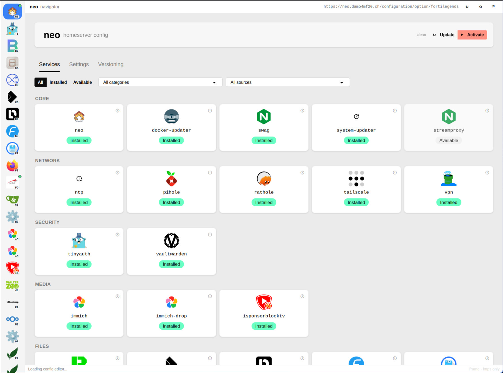
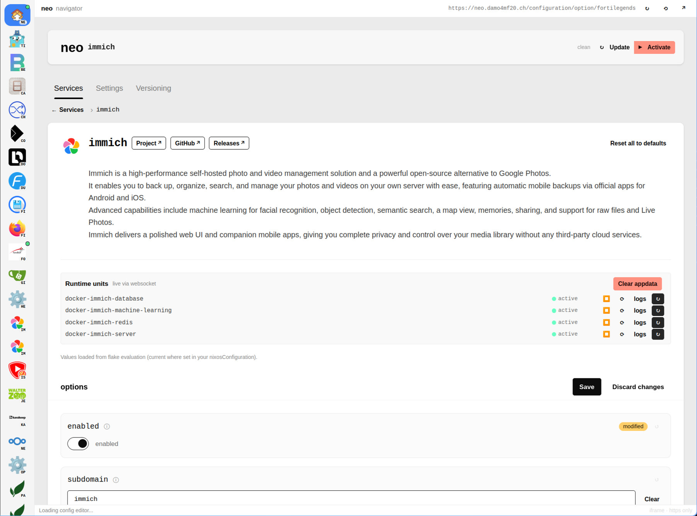
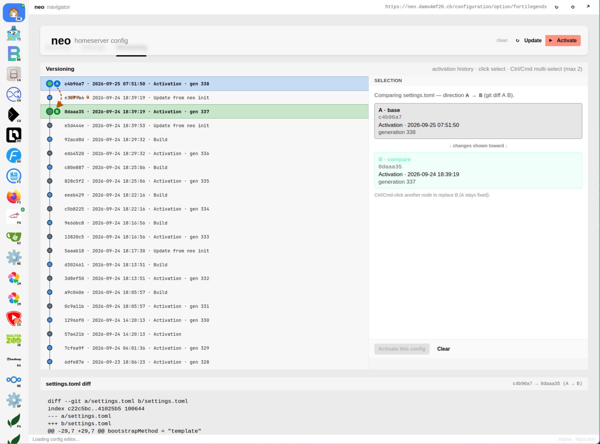

# Neo Homeserver

  

**Your data. Your machine. Your software.**

Neo is a homeserver operating system. Flash it onto a machine. Easy to use without any technical knowledge, with opinionated defaults and a simple web interface for full control. Reproducible, revertible, recoverable. The easiest way to keep your data private, fully featured so you can free yourself from big tech.

Photos, files, passwords, documents stay on hardware you control.

> If you can't host it and control it, you don't really own it.
>
> [Louis Rossmann](https://www.youtube.com/watch?v=rk3snANxYMY), on repair, ownership, a [self-managed life](https://wiki.futo.org/wiki/Introduction_to_a_Self_Managed_Life:_a_13_hour_%26_28_minute_presentation_by_FUTO_software).

That's Neo's philosophy. Sovereignty over your machine, privacy for your life on it, ownership of the software and the data.

**Documentation.** [Install](docs/INSTALL.md) · [How it works](docs/ARCHITECTURE.md) · [Plugins](docs/PLUGINS.md) · [CLI](docs/CLI.md)

## Getting started

Install Neo. Open the web UI. Set the domain. Set the login. Turn services on. Apply.

Full steps: [Installation guide](docs/INSTALL.md).

## What it looks like

**Services.** Everything you can turn on.

**One service.** Immich, with live status, options, save, activate.

**Versioning.** History of the machine, a diff between two generations, rollback.

## What you need

- A machine you flash Neo onto
- A domain name
- A public IP

If the machine at home has no public IP, route the traffic with [streamproxy](docs/INSTALL.md#no-public-ip-streamproxy). HTTPS still reaches it. The data stays on your hardware.

## Features

### Every day

- **Opinionated defaults.** A firewalled host, services on an internal network, packaging chosen for you.
- **Simple web interface.** Full control in the browser. Enable a service, edit it, apply it, revert an edit before it goes live.
- **User management.** Add people. Provision the services each person should have.
- **Automatic HTTPS.** Certificates stay current. Traffic stays encrypted until it reaches your server.
- **Automatic updates.** The operating system, the containers, the apps. Everything, on a schedule, all the way through.

### AI support

- **Your IT support.** Hermes helps you run the homeserver. Useful on day one. Useful after you know the system well.
- **Your provider.** The model comes from the AI provider you choose.
- **In every service.** Each service you enable is integrated with Hermes, and Hermes can operate it.
- **Health, reports, recommendations.** Hermes checks the machine, reports what broke, and recommends the next step.

### Your hardware

- **Your machine.** The homeserver is hardware you control.
- **Home or anywhere.** Host it at home. Host it anywhere. Safe on a public Wi-Fi uplink.
- **Fine-grained access control.** Per service, per person: who can reach it on the LAN, on Tailscale, on the public web.

### Privacy

- **LAN privacy.** Pi-hole across the network. WireGuard egress for the apps you choose. Tailscale for private reach. NTP for the LAN.
- **Off-site backup.** Scheduled rsync over SSH to a machine you choose.

### Extend

- **Plugins.** Media stacks, personal apps, extra config, on the same HTTPS and the same login. [Plugins](docs/PLUGINS.md).

### Under the hood

- **Nix-based.** This is why the system is reproducible, revertible, recoverable. Rebuild the same machine. Switch back to an earlier generation. Recover from configuration you still hold.

## Services

Enable what you want in the web UI.

- **Files.** Filebrowser, Dufs (WebDAV), Syncthing, Nextcloud, Collabora, Paperless, Docmost, Stirling PDF, Gitea
- **Photos.** Immich, Immich Drop
- **Media.** Jellyfin, Sonarr, Radarr, the rest of the \*arr stack, from the [highsea.neo](https://github.com/madebydamo/highsea.neo) plugin
- **Passwords.** Vaultwarden
- **Calendar.** RustiCal (CalDAV, CardDAV), Calino, iCal subscriptions
- **Utilities.** SearXNG, Karakeep, pastebin, change detection, Activepieces, Webtop, Firefox, iSponsorBlockTV
- **Network.** Pi-hole, Tailscale, WireGuard
- **Monitoring.** Beszel
- **AI support.** Hermes
- **Administration.** Neo web
- **Your own.** Neo is fully extendable with your own Nix plugins. Whatever you can imagine. [Plugins](docs/PLUGINS.md).

## For contributors

Work on Neo itself starts at **[AGENTS.md](AGENTS.md)**.

---

**Own your stack.** Issues welcome. Contributions welcome.
