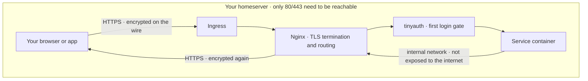
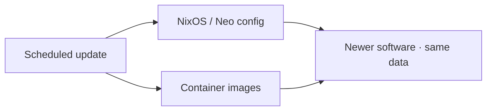
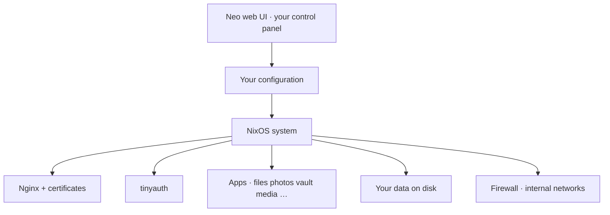
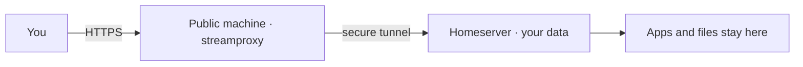

# How Neo works

This page explains the homeserver in plain language. Product pitch: [../README.md](../README.md). Install steps: [INSTALL.md](INSTALL.md).

Deep packaging detail for contributors lives in [AGENTS.md](../AGENTS.md)—you do not need that to *use* Neo.

## The idea

Neo runs **all of your services on one machine you control**. You manage day-to-day life in the **web UI**: turn apps on, set domain and users, apply changes. Under the hood, NixOS keeps the system **reproducible** (same config → same result), **revertable** (bad update? go back), and **recoverable** (config + data you can restore).

Opinionated defaults mean security and HTTPS are not a homework assignment.

## Communication (the important picture)

From your phone or laptop to an app and back:

**Ingress** is either:

- your machine’s **public IP**, or  
- **streamproxy** on a public machine that forwards to your homeserver  

…from your perspective it is still “HTTPS to my domain.”

### What that means for privacy and ownership

| Step | What happens |
|------|----------------|
| On the internet | Traffic is **encrypted (TLS)**. Passers-by and random servers do not see your content in the clear. |
| On *your* machine | Nginx decrypts, checks **tinyauth**, routes to the right app. Many apps also have **their own login**—double authentication for almost everything. |
| Between apps | Services talk on an **internal** network. They are not each hanging on a public port. |
| Back to you | The response is **encrypted again** before it leaves the server. |

You only need to expose **ports 80 and 443**. Nothing else is required for normal web access. The box can sit at home; it does not need to “be the whole internet”—it needs a path for those two ports (direct or via streamproxy).

## Automatic updates

System and containers can refresh on a schedule so you get **new versions and security fixes without weekend maintenance**. Combined with Nix’s rollbacks, updates are something Neo can do *for* you—not a second job.

## What’s on the machine (simple map)

- **Neo web** — where normal users spend their time.  
- **Apps** — open source services you enable; they store data under Neo’s volume layout on *your* disks.  
- **Plugins** — optional packs of extra apps or Nix bits ([PLUGINS.md](PLUGINS.md)); same security front door.

## Streamproxy (no public IP at home)

If the homeserver cannot accept 80/443 from the internet (CGNAT, locked router, …):

DNS still points at the **public** side. Your **data stays on the homeserver**. You need a working tunnel (e.g. rathole) and matching streamproxy access—see [INSTALL.md](INSTALL.md#streamproxy-and-machines-without-a-public-ip).

## For the curious (optional technical notes)

These details are for people who want to dig in or contribute. Everyday users can stop above.

### Why NixOS

- **Reproducible** builds from declared configuration  
- **Generations / rollbacks** when something breaks  
- **Declarative services** so “what should be running” is not tribal knowledge  

Neo wraps that so you get the benefits without writing a custom NixOS module set from zero.

### Module layout (developers)

The Neo repository uses flake-parts and auto-imported modules under `nix/` (Dendritic style). Services typically split into options, implementation, and reverse-proxy snippets. Plugins are separate flakes that export a NixOS module Neo imports when you add them in the UI.

See [AGENTS.md](../AGENTS.md) and [CLI.md](CLI.md) for contributor tooling. Power users who prefer a terminal over the web UI can use the optional CLI; it is **not** required for normal operation.

### Web option form metadata (contributors)

Service options can declare **`rank`**, **`helper`**, and **`ui`** (see `nix/lib/option.nix`, `nix/lib/ui.nix`, `nix/lib/helpers/`). The web UI schema extractor (`cli/src/commands/web/nix/extract_service_options.nix`) serializes these into JSON; Alpine + Handlebars render fields generically:

- **`ui.choices`** → multi-select (`type.values`)
- **`ui.keysFrom`** → attrsOf keys locked to another option
- **`ui.widget`** → composite editor (e.g. `exclusiveListPair` for allow/block mode cards)

Special UIs should be declared on the option, not branched by service name in the form. Full checklist: [AGENTS.md](../AGENTS.md#web-ui-option-metadata-rank--helper--ui).
